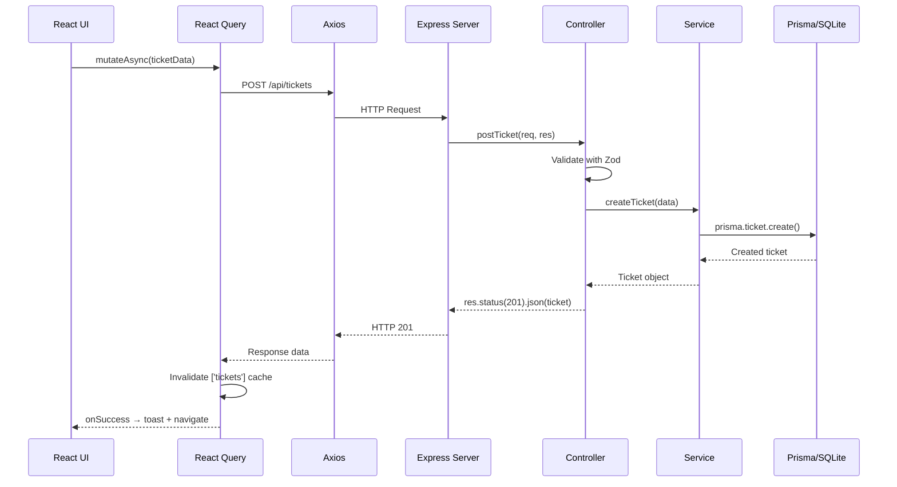
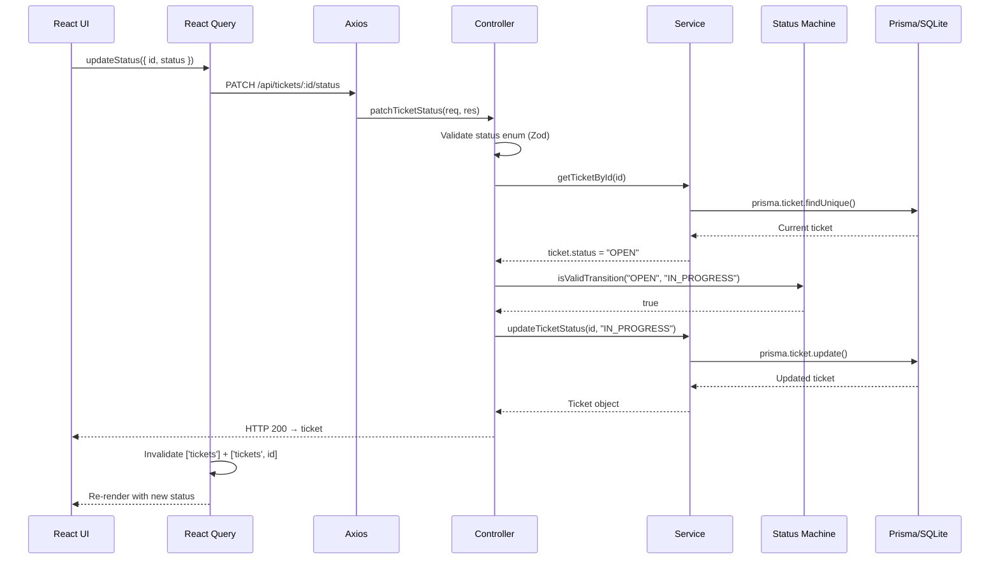
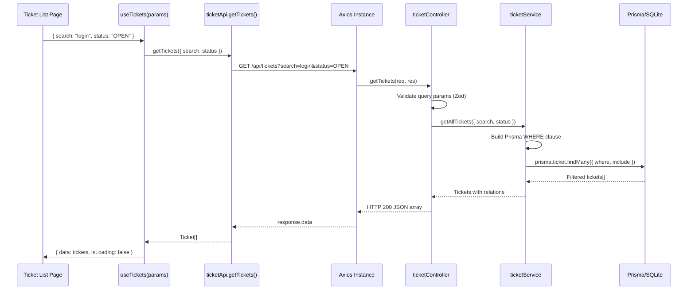
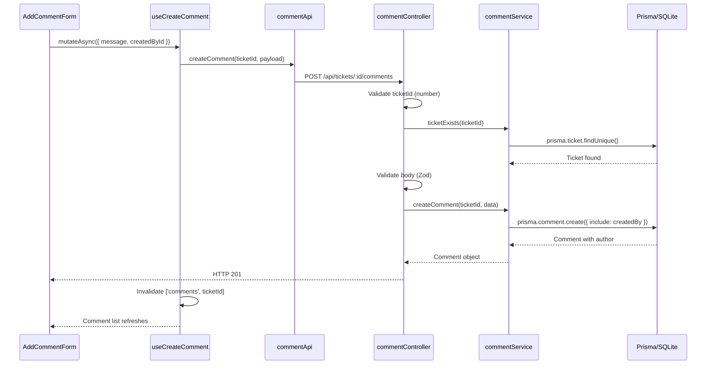
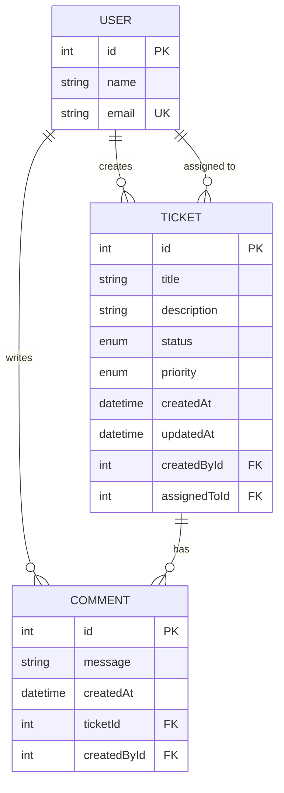
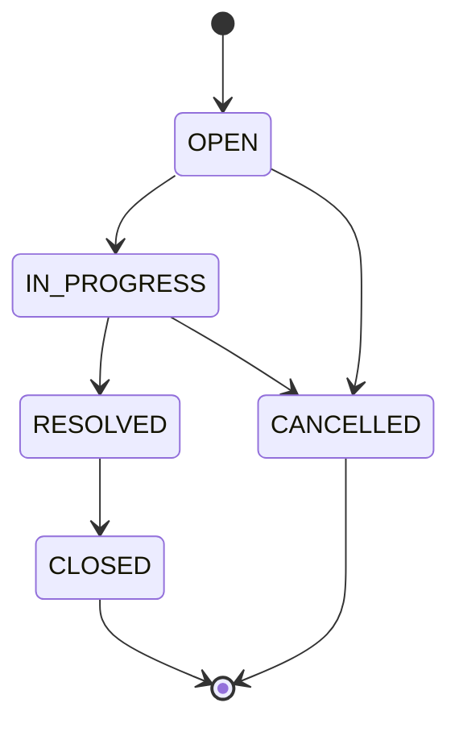

# Architecture

## Overview

The Support Ticket Management System follows a simple, modular architecture designed to meet the assessment requirements while remaining easy to understand and maintain.

The application is divided into three independent workspaces:

- **Frontend** – React application for the user interface
- **Backend** – Express REST API
- **Database** – Prisma ORM with SQLite

This separation keeps responsibilities clear and allows each layer to evolve independently.

---

# High-Level Architecture

```text
+----------------------+
|      React UI        |
|  (Chakra UI + TS)    |
+----------+-----------+
           |
      HTTP (Axios)
           |
+----------v-----------+
|     Express API      |
|  Routes → Controller |
|        → Service     |
+----------+-----------+
           |
     Prisma Client
           |
+----------v-----------+
|      SQLite DB       |
+----------------------+
```

---

# Monorepo Structure

The project is organized as a monorepo using npm workspaces.

```text
ai-practical-assessment/
│
├── frontend/
├── backend/
├── database/
├── docs/
├── package.json
└── README.md
```

### Why Monorepo?

- Single repository for the entire application.
- Shared dependency management.
- Easier local development.
- Simple project setup for the assessment.

---

# Frontend Architecture

The frontend follows a **feature-based architecture**, grouping related components, hooks, services, and pages by domain.

```text
src/
│
├── app/
├── components/
├── features/
│   └── tickets/
│       ├── api/
│       ├── components/
│       ├── hooks/
│       ├── pages/
│       ├── utils/
│       └── types.ts
├── services/
├── shared/
└── theme/
```

## Why Feature-Based Architecture?

Instead of organizing files by type (components, hooks, pages), all ticket-related files are grouped together.

Benefits:

- Easier navigation.
- Better scalability.
- Reduced coupling.
- Clear ownership of functionality.

---

# Frontend Data Flow

```text
UI Component
     ↓
React Query Hook (useTickets, useTicket, useCreateTicket, etc.)
     ↓
API Service Function (ticketApi.ts, commentApi.ts)
     ↓
Axios Instance (services/api.ts)
     ↓ HTTP Request
Express Route
     ↓
Controller (parse request, format response)
     ↓
Service (business logic, validation)
     ↓
Prisma Client
     ↓
SQLite Database
```

### Response flows back up the same chain:

```text
SQLite → Prisma → Service → Controller → HTTP Response → Axios → React Query Cache → UI Re-render
```

---

# Sequence Diagrams

## Create Ticket Flow



## Update Status Flow



## Fetch Ticket List with Filters



## Add Comment Flow



---

# Backend Architecture

The backend follows a simple layered architecture.

```text
Route
   ↓
Controller
   ↓
Service
   ↓
Prisma
   ↓
SQLite
```

## Responsibilities

### Routes

- Define API endpoints.
- Forward requests to controllers.
- No business logic.

### Controllers

- Validate request data using Zod.
- Handle HTTP responses.
- Coordinate request flow.
- Return consistent error format.

### Services

- Contain business logic.
- Interact with Prisma.
- Enforce ticket status transition rules.
- Trim input whitespace.
- Build dynamic query filters.

### Prisma

- Database access layer.
- Generates type-safe queries.
- Maps application models to SQLite.
- Handles relations via `include` / `select`.

---

# Database Design

## Entity-Relationship Diagram



## Models

### User

| Field | Type | Constraints | Description |
|-------|------|-------------|-------------|
| id | Int | PK, autoincrement | Unique identifier |
| name | String | required | Display name |
| email | String | unique | Email address |

**Relationships:**
- One User can create many Tickets (`createdTickets`)
- One User can be assigned many Tickets (`assignedTickets`)
- One User can write many Comments (`comments`)

### Ticket

| Field | Type | Constraints | Description |
|-------|------|-------------|-------------|
| id | Int | PK, autoincrement | Unique identifier |
| title | String | required, max 200 | Short issue summary |
| description | String | required, max 2000 | Detailed explanation |
| status | Enum | default OPEN | Lifecycle state |
| priority | Enum | default MEDIUM | Urgency level (LOW, MEDIUM, HIGH) |
| createdAt | DateTime | auto | Creation timestamp |
| updatedAt | DateTime | auto | Last modification |
| createdById | Int? | FK → User | Who created this ticket |
| assignedToId | Int? | FK → User | Who is working on it |

**Relationships:**
- Belongs to one User (creator) — nullable
- Belongs to one User (assignee) — nullable
- Has many Comments (cascade delete)

### Comment

| Field | Type | Constraints | Description |
|-------|------|-------------|-------------|
| id | Int | PK, autoincrement | Unique identifier |
| message | String | required, max 1000 | Comment text |
| createdAt | DateTime | auto | When posted |
| ticketId | Int | FK → Ticket | Parent ticket |
| createdById | Int? | FK → User | Comment author |

**Relationships:**
- Belongs to one Ticket (cascade — deleted when ticket is deleted)
- Belongs to one User (author) — nullable

## Enums

### Status
`OPEN` | `IN_PROGRESS` | `RESOLVED` | `CLOSED` | `CANCELLED`

### Priority
`LOW` | `MEDIUM` | `HIGH`

---

# API Design

The backend exposes a REST API.

| Method | Endpoint | Purpose |
|--------|----------|---------|
| GET | /api/tickets | List tickets (with search + status filter) |
| POST | /api/tickets | Create ticket |
| GET | /api/tickets/:id | Ticket details (with comments) |
| PUT | /api/tickets/:id | Update ticket fields |
| PATCH | /api/tickets/:id/status | Update ticket status |
| GET | /api/tickets/:id/comments | List comments for a ticket |
| POST | /api/tickets/:id/comments | Add comment to a ticket |
| GET | /api/users | List all users |
| GET | /health | Health check |

### Query Parameters (GET /api/tickets)

| Parameter | Type | Description |
|-----------|------|-------------|
| search | string | Search title and description (case-insensitive) |
| status | enum | Filter by status |

### Response Format

```text
Success (single):  { id, title, description, status, priority, ... }
Success (list):    [ { ... }, { ... } ]
Error:             { status, error, message, details? }
```

---

# State Management

The frontend uses **TanStack Query** for server state management.

### Query Keys

| Key | Used By | Invalidated By |
|-----|---------|----------------|
| `['tickets']` | useTickets | createTicket, updateTicket, updateStatus |
| `['tickets', id]` | useTicket | updateTicket, updateStatus |
| `['comments', ticketId]` | useComments | createComment |
| `['users']` | useUsers | — |

### Cache Invalidation Strategy

- Creating a ticket → invalidates ticket list
- Updating a ticket → invalidates ticket list + ticket detail
- Updating status → invalidates ticket list + ticket detail
- Adding a comment → invalidates only that ticket's comments

Local UI state (form inputs, filters, search) is managed using React state + URL params.

---

# Form Management

Forms are implemented using:

- React Hook Form
- Zod

Benefits:

- Minimal re-renders.
- Strong TypeScript support.
- Shared validation approach (same Zod schemas conceptually on frontend and backend).
- Better user experience (validate on blur).

---

# UI Architecture

The application uses **Chakra UI** for component styling.

Reasons for choosing Chakra UI:

- Component-based design.
- Built-in accessibility.
- Responsive style props.
- Consistent design system.
- Minimal custom CSS.

A custom theme is used to centralize design tokens and maintain consistent styling.

---

# Validation Strategy

Validation occurs at two levels.

## Frontend

Zod validates user input before API requests are sent.

- Required fields
- Maximum length
- Enum constraints
- Validation mode: onBlur

## Backend

All incoming requests are validated again using Zod.

- Request body validation (POST, PUT, PATCH)
- Query parameter validation (GET)
- Path parameter validation (numeric ID check)

This ensures invalid requests cannot bypass frontend validation.

---

# Error Handling

Errors are handled consistently across the application.

### Backend

| Scenario | HTTP Status | Response |
|----------|-------------|----------|
| Validation failure | 400 | `{ error: "Validation Error", details: [...] }` |
| Invalid status transition | 400 | `{ error: "Invalid Transition", message: "..." }` |
| Resource not found | 404 | `{ error: "Not Found", message: "..." }` |
| Unexpected error | 500 | `{ error: "Internal Server Error" }` |

### Frontend

| Scenario | UI Response |
|----------|-------------|
| Loading | Skeleton placeholders |
| Error | Alert component with message |
| Not found | "Ticket Not Found" page |
| Empty list | Empty state with CTA |
| Success action | Toast notification |

---

# Ticket Status Lifecycle

The application enforces a state machine with terminal states.



### Valid Transitions

| From | To |
|------|----|
| OPEN | IN_PROGRESS, CANCELLED |
| IN_PROGRESS | RESOLVED, CANCELLED |
| RESOLVED | CLOSED |
| CLOSED | (terminal — no transitions) |
| CANCELLED | (terminal — no transitions) |

### Enforcement

- **Backend:** `isValidTransition()` in service layer rejects invalid transitions with 400.
- **Frontend:** `getValidTransitions()` only renders valid options in the UI.
- **Both layers** share the same transition logic for consistency.

---

# Design Principles

The architecture follows a few guiding principles:

- Keep the project simple.
- Prefer readability over abstraction.
- Separate responsibilities clearly.
- Validate all external input.
- Reuse shared components where appropriate.
- Avoid unnecessary dependencies.
- Status workflow enforced at service layer (not controller).
- Relations returned via Prisma includes (not separate queries).

---

# Key Technology Decisions

| Technology | Reason |
|------------|--------|
| React 19 | Component-based frontend development |
| TypeScript | Static typing and improved maintainability |
| Chakra UI v3 | Accessible UI components with minimal custom styling |
| TanStack Query v5 | Efficient server state management with cache invalidation |
| React Hook Form | Lightweight form handling with validation integration |
| Zod v4 | Shared validation strategy with TypeScript inference |
| Express 5 | Simple REST API framework |
| Prisma | Type-safe ORM with relation includes |
| SQLite | Lightweight database suitable for the assessment |
| Vitest | Fast testing framework for both frontend and backend |
| Supertest | HTTP integration testing without starting a server |

---

# Testing Architecture

```text
Backend (75 tests):
├── Unit: statusMachine (17 tests)
└── Integration: Supertest
    ├── health (1)
    ├── GET /tickets (6)
    ├── POST /tickets (9)
    ├── PUT /tickets/:id (15)
    ├── PATCH /tickets/:id/status (13)
    └── Comments API (14)

Frontend (15 tests):
├── Unit: statusMachine (5)
├── Unit: formatDate (3)
└── Component: TicketFilters (7)
```

---

# Future Improvements

If additional time were available, the architecture could be extended with:

- Authentication and authorization.
- Role-based access control.
- Pagination and sorting.
- File attachments.
- Activity history / audit log.
- WebSocket for real-time updates.
- CI/CD pipeline.
- Higher test coverage (page-level integration tests).
